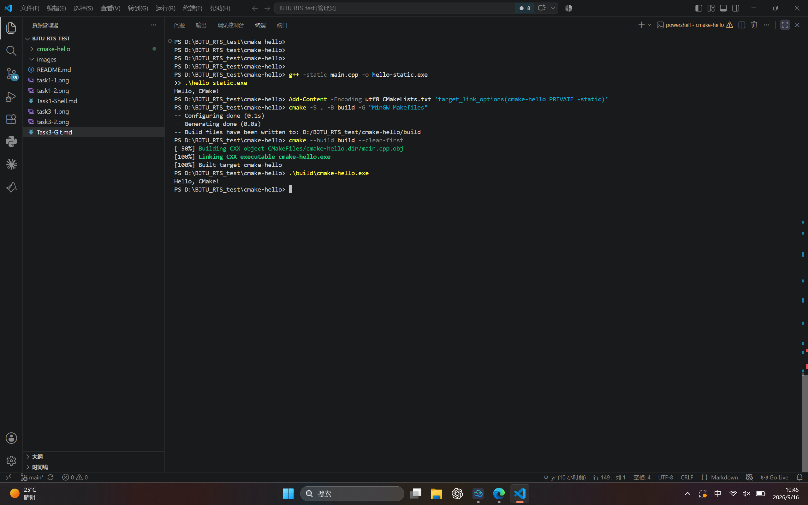

# BJTU-RTS 视觉算法组 Task4：CMake 学习报告

## 一、实验环境

- 操作系统：Windows 11
- 开发工具：Visual Studio Code
- CMake 版本：4.4.3
- C++ 编译器：MinGW-W64 GCC 16.1.0
- 构建生成器：MinGW Makefiles

## 二、任务目标

学习使用 CMake 管理 C++ 项目，完成一个简单程序的配置、编译和运行。

## 三、项目文件

项目目录为 `cmake-hello`，包含以下两个主要文件：

```text
cmake-hello/
├── CMakeLists.txt
└── main.cpp
```

### 1. main.cpp

```cpp
#include <iostream>

int main() {
    std::cout << "Hello, CMake!" << std::endl;
    return 0;
}
```

该程序向终端输出 `Hello, CMake!`。

### 2. CMakeLists.txt

```cmake
cmake_minimum_required(VERSION 3.20)

project(CMakeHello LANGUAGES CXX)

set(CMAKE_CXX_STANDARD 17)
set(CMAKE_CXX_STANDARD_REQUIRED ON)

add_executable(cmake-hello main.cpp)

target_link_options(cmake-hello PRIVATE -static)
```

其中：

- `cmake_minimum_required` 指定所需的最低 CMake 版本。
- `project` 创建名为 `CMakeHello` 的 C++ 项目。
- `set(CMAKE_CXX_STANDARD 17)` 指定使用 C++17 标准。
- `add_executable` 根据 `main.cpp` 生成可执行文件 `cmake-hello.exe`。
- `target_link_options(... -static)` 使用静态链接，避免 MinGW 动态运行库导致的启动异常。

## 四、构建过程

### 1. 配置项目

执行命令：

```powershell
cmake -S . -B build -G "MinGW Makefiles"
```

参数说明：

- `-S .`：源代码目录为当前目录。
- `-B build`：将构建文件生成到 `build` 目录。
- `-G "MinGW Makefiles"`：使用 MinGW Makefiles 生成器。

配置完成后，CMake 成功识别到 GNU 16.1.0 C++ 编译器，并在 `build` 目录中生成构建文件。

### 2. 编译项目

执行命令：

```powershell
cmake --build build --clean-first
```

编译成功后显示：

```text
Built target cmake-hello
```

### 3. 运行程序

执行命令：

```powershell
.\build\cmake-hello.exe
```

运行结果：

```text
Hello, CMake!
```

## 五、遇到的问题及解决方法

初次运行生成的程序时，程序没有输出内容，退出代码为 `-1073741819`。该问题与 MinGW 动态运行库有关。

使用静态链接方式重新编译后，程序能够正常运行。修改方法是在 `CMakeLists.txt` 中添加：

```cmake
target_link_options(cmake-hello PRIVATE -static)
```

然后重新配置、编译并运行项目，成功得到预期输出。

## 六、学习总结

通过本次任务，我掌握了 CMake 的基本工作流程：编写 `CMakeLists.txt` 描述项目结构，使用 CMake 生成构建文件，再调用 CMake 编译并运行程序。

CMake 将项目配置和编译过程分离，便于管理包含多个源文件和依赖库的 C++ 项目。这也为后续学习 OpenCV 等 C++ 库的构建与使用打下基础。

## 七、实验截图


