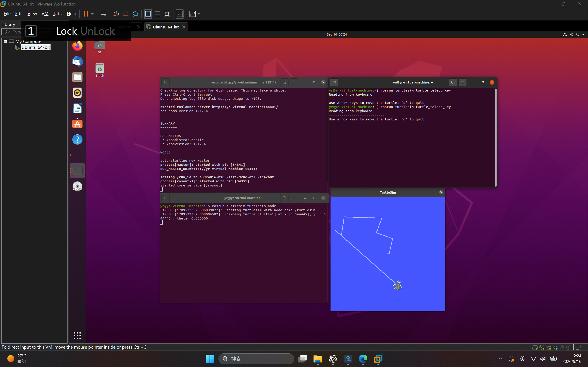
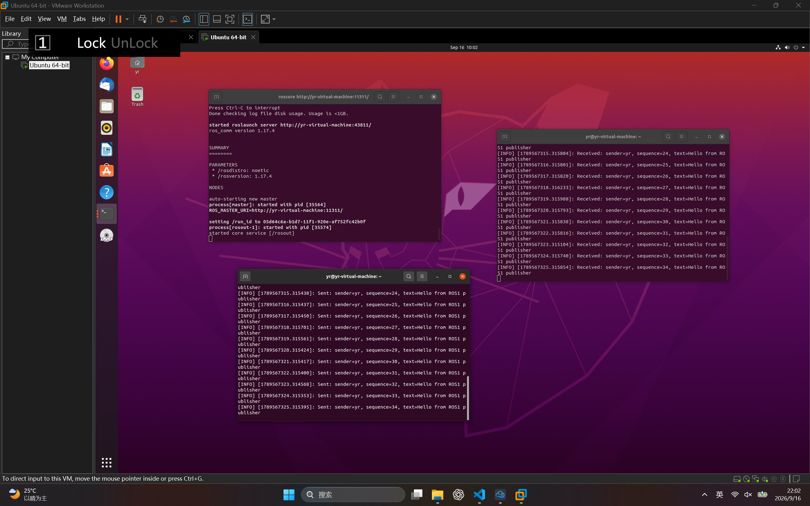

# BJTU-RTS 视觉算法组 Task6：ROS1 学习报告

## 一、实验环境

- 操作系统：Ubuntu 20.04.6 LTS
- 虚拟机：VMware Workstation Pro
- ROS 版本：ROS Noetic
- ROS 通信框架：ROS1
- 测试工具：turtlesim

## 二、任务目标

安装并配置 ROS1 Noetic，理解 ROS 主节点、节点和话题通信的基本概念，使用 turtlesim 完成海龟仿真与键盘控制。

## 三、ROS 安装与配置

首先确认 Ubuntu 系统版本：

```bash
lsb_release -sc
```

运行结果：

```text
focal
```

Ubuntu 20.04 的代号为 `focal`，对应 ROS1 Noetic。

安装 ROS 所需的基础工具：

```bash
sudo apt update && sudo apt install -y curl gnupg lsb-release
```

由于 ROS Noetic 已停止维护，普通软件源的旧签名密钥无法通过验证，因此使用 ROS Noetic 最终快照软件源。

安装 ROS 桌面完整版：

```bash
sudo apt -o Acquire::ForceIPv4=true -o Acquire::Retries=5 --fix-missing install -y ros-noetic-desktop-full
```

安装完成后，将 ROS 环境加载命令写入 Bash 配置文件：

```bash
echo "source /opt/ros/noetic/setup.bash" >> ~/.bashrc
source ~/.bashrc
```

验证 ROS 版本：

```bash
rosversion -d
```

运行结果：

```text
noetic
```

## 四、ROS 基本概念

- `roscore`：ROS 的核心服务，负责启动 ROS Master、参数服务器和日志节点。
- ROS Master：负责管理节点之间的通信信息。
- 节点：ROS 中独立运行的功能模块。
- 话题：节点之间通过发布和订阅方式交换数据的通信通道。
- `turtlesim`：ROS 自带的二维海龟仿真程序，可用于学习节点和话题通信。

## 五、turtlesim 仿真实验

### 1. 启动 ROS 核心服务

在第一个终端执行：

```bash
roscore
```

启动成功后显示：

```text
started core service [/rosout]
```

### 2. 启动海龟仿真节点

在第二个终端执行：

```bash
rosrun turtlesim turtlesim_node
```

该命令启动 turtlesim 节点，并打开海龟仿真窗口。

### 3. 启动键盘控制节点

在第三个终端执行：

```bash
rosrun turtlesim turtle_teleop_key
```

终端提示：

```text
Use arrow keys to move the turtle. 'q' to quit.
```

点击键盘控制终端后，使用方向键控制海龟移动。海龟移动时会在窗口中留下轨迹，说明控制节点已经通过 ROS 通信机制向仿真节点发送了运动指令。

## 六、实验结果

实验中成功启动了 ROS Master、turtlesim 节点和键盘控制节点，并使用方向键控制海龟移动。



## 七、自定义消息发布与订阅实验

为满足 ROS1 话题通信和自定义消息的学习要求，在 Catkin 工作空间中创建了两个功能包：

- `message_publisher`：发送自定义消息，并包含 `msg/CustomMessage.msg`。
- `message_subscriber`：订阅 `custom_message` 话题并在终端打印收到的消息。

自定义消息文件内容如下：

```text
string sender
int32 sequence
string text
```

完成源码编写后，在工作空间根目录执行：

```bash
cd ~/catkin_ws
catkin_make
source devel/setup.bash
```

启动顺序如下：

```bash
# Terminal 1
roscore

# Terminal 2
source ~/catkin_ws/devel/setup.bash
rosrun message_subscriber subscriber.py

# Terminal 3
source ~/catkin_ws/devel/setup.bash
rosrun message_publisher publisher.py
```

发送节点以 1 Hz 的频率向 `custom_message` 话题发送消息；接收节点会显示 `Received: sender=yr, sequence=...`。这说明自定义消息已在两个 ROS 功能包之间成功传递。



## 八、遇到的问题及解决方法

### 1. ROS 软件源密钥校验失败

添加普通 ROS1 软件源后，`sudo apt update` 提示缺少公钥，原因是 ROS Noetic 已停止维护，旧软件源密钥不再适用。

解决方法是使用 ROS Noetic 最终快照软件源，并配置对应密钥。

### 2. Ubuntu 镜像源连接超时

原先的交大镜像出现连接超时，导致 ROS 安装包无法下载。

解决方法是将 Ubuntu 软件源切换为阿里云镜像，并强制 apt 使用 IPv4：

```bash
sudo apt -o Acquire::ForceIPv4=true update
```

### 3. VMware 中方向键无法控制海龟

开始时 VMware 没有将键盘输入交给虚拟机。点击控制终端并按 `Ctrl + G` 捕获键盘输入后，方向键可以正常控制海龟。

## 九、学习总结

通过本次任务，我完成了 ROS1 Noetic 的安装与环境配置，理解了 ROS Master、节点和话题通信的基本概念。

使用 turtlesim 仿真实验后，我掌握了通过 `roscore` 启动核心服务、使用 `rosrun` 启动节点，以及通过键盘控制节点与仿真节点进行通信的基本流程。

进一步完成自定义消息的发布与订阅后，我理解了 Catkin 功能包、`.msg` 消息定义、发布者和订阅者之间的关系。这为后续学习机器人感知、导航和视觉算法奠定了基础。
