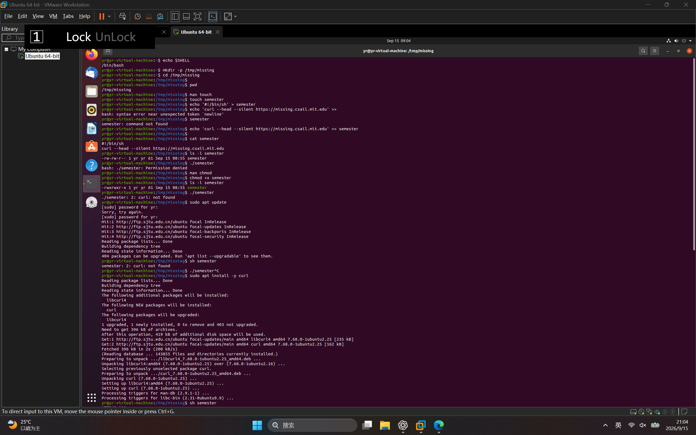
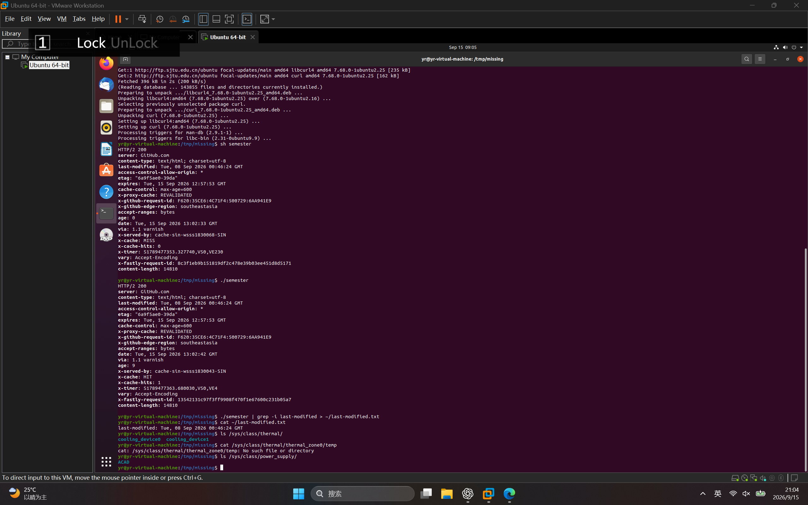

# BJTU-RTS 视觉算法组 Task1：Shell 学习报告

## 一、实验环境

- 操作系统：Ubuntu 20.04.6 LTS
- 虚拟机软件：VMware Workstation Pro
- Shell：Bash
- 用户名：yr

## 二、任务目的

通过 MIT Missing Semester 的 Shell 课程，学习 Linux 命令行的基本使用方法，包括目录操作、文件创建、权限管理、脚本执行、管道和输出重定向。

## 三、任务过程

### 1. 检查当前 Shell

执行命令：

```bash
echo $SHELL
```

运行结果：

```text
/bin/bash
```

`$SHELL` 是保存当前 Shell 路径的环境变量，`echo` 用于显示变量内容。结果表明当前使用的是 Bash。


### 2. 创建并进入目录

执行命令：

```bash
mkdir -p /tmp/missing
cd /tmp/missing
pwd
```

命令解释：

- `mkdir`：创建目录。
- `-p`：当上级目录不存在时一并创建，并避免目录已存在时报错。
- `cd`：切换当前工作目录。
- `pwd`：显示当前工作目录的绝对路径。

运行结果：

```text
/tmp/missing
```


### 3. 查看 touch 命令手册

执行命令：

```bash
man touch
```

`man` 用于查看命令的帮助文档。进入手册后可以使用方向键或滚轮浏览，按 `q` 退出。

通过手册可知，`touch` 可以创建空文件，也可以修改文件的访问时间和修改时间。

### 4. 创建 semester 文件

执行命令：

```bash
touch semester
```

该命令在 `/tmp/missing` 中创建了一个名为 `semester` 的空文件。

### 5. 向文件中写入脚本

执行命令：

```bash
echo '#!/bin/sh' > semester
echo 'curl --head --silent https://missing.csail.mit.edu' >> semester
cat semester
```

文件内容：

```bash
#!/bin/sh
curl --head --silent https://missing.csail.mit.edu
```

命令解释：

- `echo`：输出指定的字符串。
- `>`：将输出写入文件，并覆盖文件原有内容。
- `>>`：将输出追加到文件末尾。
- `cat`：读取并显示文件内容。
- `#!/bin/sh`：shebang，表示使用 `/bin/sh` 解释执行该脚本。
- `curl --head --silent`：静默访问网站并输出 HTTP 响应头。

### 6. 直接运行脚本

首先查看文件权限：

```bash
ls -l semester
```

然后尝试执行：

```bash
./semester
```

终端提示：

```text
Permission denied
```

这是因为新建的 `semester` 文件只有读写权限，没有执行权限。`./` 表示运行当前目录中的文件。

### 7. 使用 sh 解释器运行脚本

执行命令：

```bash
sh semester
```

虽然文件没有执行权限，但该命令能够运行，因为真正被执行的是具有执行权限的 `sh` 程序，`semester` 文件只是作为参数交给 `sh` 读取和解释。

### 8. 查看 chmod 命令手册

执行命令：

```bash
man chmod
```

`chmod` 用于修改文件或目录的权限。按 `q` 可以退出手册。

### 9. 添加执行权限

执行命令：

```bash
chmod +x semester
ls -l semester
./semester
```

`chmod +x semester` 为文件增加执行权限。再次使用 `ls -l` 查看时，权限字段中出现了 `x`，例如：

```text
-rwxrwxr-x
```

此时可以直接使用 `./semester` 运行脚本。系统读取脚本第一行的 shebang，并使用 `/bin/sh` 解释后续内容。


### 10. 使用管道和重定向保存修改时间

执行命令：

```bash
./semester | grep -i last-modified > ~/last-modified.txt
cat ~/last-modified.txt
```

运行结果：

```text
last-modified: Tue, 08 Sep 2026 00:46:24 GMT
```

命令解释：

- `|`：管道，将前一个命令的输出作为后一个命令的输入。
- `grep`：从文本中筛选包含指定内容的行。
- `-i`：匹配时忽略字母大小写。
- `>`：将筛选结果写入文件。
- `~`：当前用户的主目录，即 `/home/yr`。
- `cat`：显示保存后的文件内容。


### 11. 查询硬件状态

执行命令：

```bash
ls /sys/class/thermal/
cat /sys/class/thermal/thermal_zone0/temp
ls /sys/class/power_supply/
```

`/sys` 是 Linux 提供的虚拟文件系统，可以通过文件形式查看内核和硬件设备信息。

本次实验运行于 VMware 虚拟机。虚拟硬件可能不会向 Ubuntu 暴露实体计算机的电池电量或 CPU 温度传感器，因此相关目录可能为空，或者提示对应文件不存在。这是虚拟机硬件限制，并非命令错误。


## 四、遇到的问题及解决方法

### 1. 脚本提示 Permission denied

原因是新建文件没有执行权限。使用以下命令添加执行权限：

```bash
chmod +x semester
```

### 2. 系统提示 curl: not found

原因是 Ubuntu 中尚未安装 `curl`。通过以下命令完成安装：

```bash
sudo apt update
sudo apt install -y curl
```

### 3. 虚拟机无法联网

Ubuntu 最初显示网线未连接，无法从软件源下载文件。检查 VMware 网络设置后，将网络适配器设置为桥接模式，并重新获取 IP 地址：

```bash
sudo dhclient
```

网络恢复后，可以正常访问软件源和互联网。

## 五、学习总结

通过本次任务，我掌握了 Bash 终端的基本使用方法，能够使用命令创建和切换目录、创建和查看文件、查询命令手册以及修改文件权限。

我还理解了 Shell 脚本的 shebang、执行权限、管道和重定向机制，并能够使用 `curl` 获取网站响应信息。遇到命令错误或网络问题时，可以根据终端的错误提示分析原因并逐步排查。


