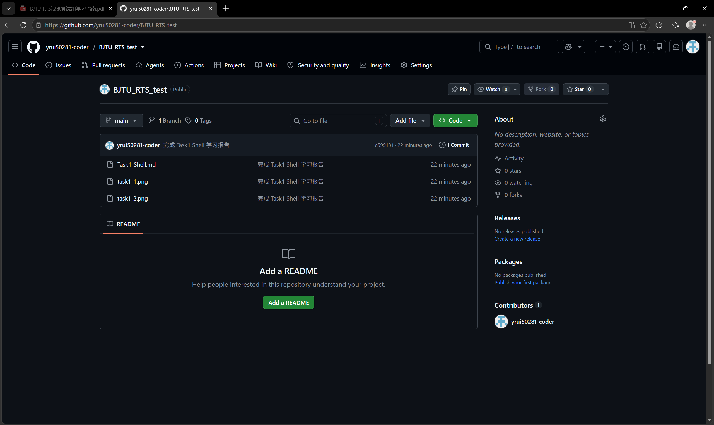
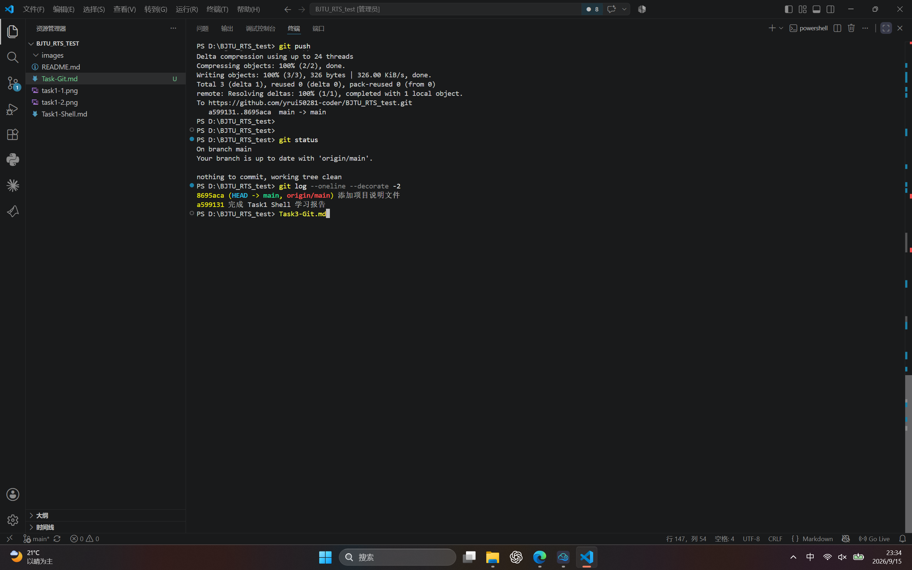

# BJTU-RTS 视觉算法组 Task3：Git 学习报告

## 一、实验环境

- 操作系统：Windows 11
- 开发工具：Visual Studio Code
- Git 版本：2.48.1.windows.1
- GitHub 账号：yrui50281-coder

## 二、任务目标

学习 Git 的基本使用流程，包括配置用户信息、初始化本地仓库、暂存和提交文件、连接 GitHub 远程仓库，以及将本地提交推送到远程仓库。

## 三、任务过程

### 1. 检查 Git 版本

执行命令：

```powershell
git --version
```

运行结果：

```text
git version 2.48.1.windows.1
```

说明 Git 已正确安装，可以在终端中使用。

### 2. 配置 Git 用户信息

执行命令：

```powershell
git config --global user.name "yr"
git config --global user.email "yrui50281@gmail.com"
git config --global --list
```

Git 会将用户名和邮箱写入每次提交的记录中，用于标识提交者。

### 3. 初始化本地仓库

在项目目录中执行：

```powershell
git init
git status
```

初始化后，Git 创建 `.git` 隐藏目录保存版本记录。`git status` 显示 Task1 报告和两张截图尚未被 Git 跟踪。

### 4. 添加并提交 Task1 文件

执行命令：

```powershell
git add .
git commit -m "完成 Task1 Shell 学习报告"
git log --oneline
```

第一次提交记录为：

```text
a599131 完成 Task1 Shell 学习报告
```

`git add .` 将文件加入暂存区，`git commit -m` 创建一次本地版本记录。

### 5. 创建 GitHub 远程仓库并推送

在 GitHub 创建仓库 `BJTU_RTS_test` 后，执行：

```powershell
git branch -M main
git remote add origin https://github.com/yrui50281-coder/BJTU_RTS_test.git
git push -u origin main
```

首次推送时出现网络连接重置错误。通过以下命令将 Git 的 HTTP 协议设置为 HTTP/1.1：

```powershell
git config --global http.version HTTP/1.1
```

重新执行推送命令后，本地仓库成功上传到 GitHub。

### 6. 修改文件并再次提交

创建项目说明文件 `README.md`：

```powershell
"# BJTU-RTS 学习记录" | Set-Content -Encoding utf8 README.md
git add README.md
git commit -m "添加项目说明文件"
git push
```

最后执行：

```powershell
git status
git log --oneline --decorate -2
```

运行结果：

```text
On branch main
Your branch is up to date with 'origin/main'.

nothing to commit, working tree clean

8695aca (HEAD -> main, origin/main) 添加项目说明文件
a599131 完成 Task1 Shell 学习报告
```

`working tree clean` 表示所有修改都已提交；本地 `main` 与远程 `origin/main` 同时指向最新提交，说明本地仓库和 GitHub 仓库已经同步。

## 四、遇到的问题及解决方法

### 1. Git 版本命令拼写错误

首次输入 `git --wersion` 时提示选项未知。将命令改为 `git --version` 后，正常显示 Git 版本信息。

### 2. 推送 GitHub 时网络连接重置

执行 `git push -u origin main` 时出现：

```text
RPC failed; curl 55 Send failure: Connection was reset
```

执行以下命令后重新推送，问题解决：

```powershell
git config --global http.version HTTP/1.1
```

## 五、学习总结

通过本次任务，我掌握了 Git 的基本工作流程：使用 `git status` 查看状态，使用 `git add` 将修改加入暂存区，使用 `git commit` 保存版本记录，并使用 `git push` 将本地提交同步到 GitHub。

Git 能够记录每次修改，并将本地项目备份到远程仓库。后续可以继续学习分支管理、合并分支和协作开发等功能。
## 六、实验截图



