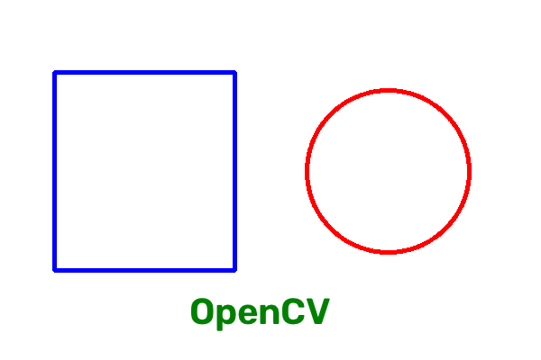
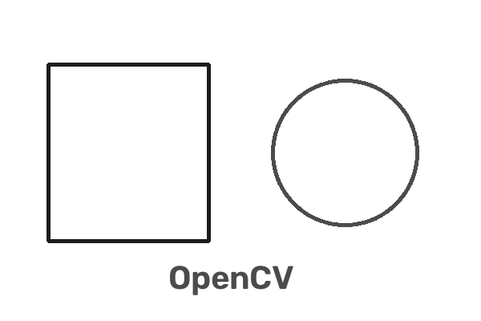
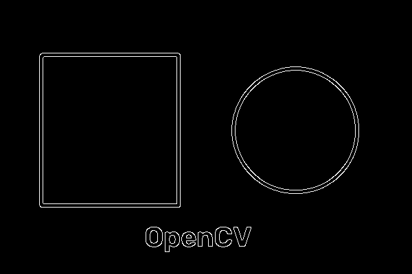

# BJTU-RTS 视觉算法组 Task5：OpenCV 学习报告

## 一、实验环境

- 操作系统：Windows 11
- 开发工具：Visual Studio Code
- Python 版本：3.14.6
- OpenCV 版本：5.0.0
- NumPy 版本：2.4.6

## 二、任务目标

学习 OpenCV 的基本使用方法，完成图像创建、绘制图形、灰度转换和边缘检测等操作。

## 三、环境配置

首先检查 Python 版本：

```powershell
python --version
```

安装 OpenCV：

```powershell
python -m pip install -i https://pypi.org/simple opencv-python
```

验证 OpenCV 是否安装成功：

```powershell
python -c "import cv2; print(cv2.__version__)"
```

运行结果为：

```text
5.0.0
```

说明 OpenCV 已成功安装。

## 四、程序代码

创建文件 `opencv-demo/opencv_demo.py`，代码如下：

```python
import cv2
import numpy as np

image = np.full((400, 600, 3), 255, dtype=np.uint8)

cv2.rectangle(image, (60, 80), (260, 300), (255, 0, 0), 4)
cv2.circle(image, (430, 190), 90, (0, 0, 255), 4)
cv2.putText(image, "OpenCV", (210, 360), cv2.FONT_HERSHEY_SIMPLEX, 1.4, (0, 128, 0), 3)

gray = cv2.cvtColor(image, cv2.COLOR_BGR2GRAY)
edges = cv2.Canny(gray, 80, 160)

cv2.imwrite("opencv-original.png", image)
cv2.imwrite("opencv-gray.png", gray)
cv2.imwrite("opencv-edges.png", edges)

print("OpenCV image processing finished.")
print("Created: opencv-original.png, opencv-gray.png, opencv-edges.png")
```

## 五、程序功能说明

- `np.full`：创建一张白色背景图像。
- `cv2.rectangle`：绘制蓝色矩形。
- `cv2.circle`：绘制红色圆形。
- `cv2.putText`：在图像中添加文字。
- `cv2.cvtColor`：将彩色图像转换为灰度图。
- `cv2.Canny`：使用 Canny 算法提取图像边缘。
- `cv2.imwrite`：将处理结果保存为图片文件。

## 六、运行结果

执行命令：

```powershell
python opencv_demo.py
```

程序输出：

```text
OpenCV image processing finished.
Created: opencv-original.png, opencv-gray.png, opencv-edges.png
```

程序生成原始图像、灰度图像和边缘检测图像。

### 1. 原始图像



### 2. 灰度图像



### 3. 边缘检测结果



## 七、遇到的问题及解决方法

首次使用清华镜像安装 OpenCV 时，镜像中没有适配 Python 3.14 的安装包。改用官方 PyPI 源后可以正常下载。

下载过程中曾因网络中断而失败，使用以下命令提高超时时间和重试次数后完成安装：

```powershell
python -m pip install --no-cache-dir --timeout 120 --retries 10 -i https://pypi.org/simple opencv-python
```

## 八、学习总结

通过本次任务，我掌握了 OpenCV 的基础使用方法，包括创建图像、绘制基本图形、添加文字、灰度转换和 Canny 边缘检测。

OpenCV 能够方便地完成常见图像处理任务，是后续学习目标检测、图像识别和视觉算法的重要工具。