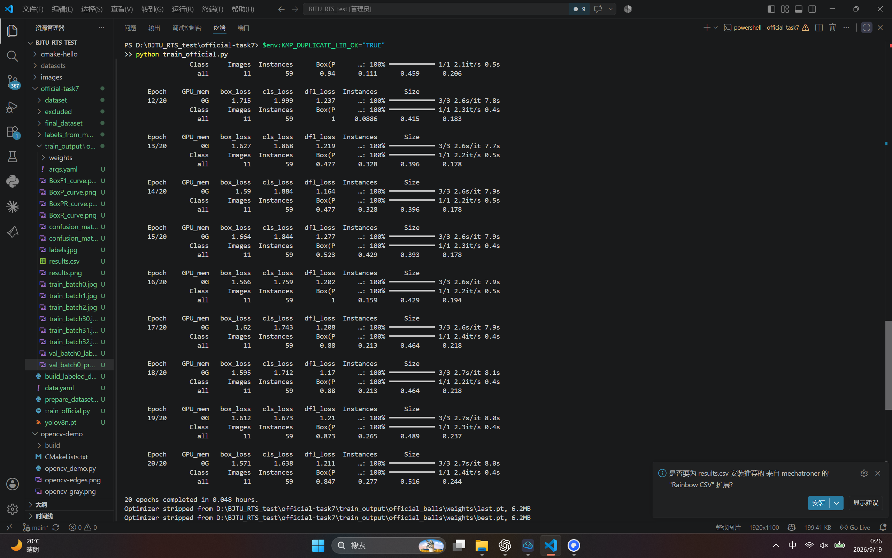

# BJTU-RTS 视觉算法组 Task7：YOLOv8 球类目标检测

## 一、任务目的

使用官方提供的球类图片，自行标注数据集，并训练 YOLOv8 模型，完成蓝球、红球和无效球的目标检测。保存训练权重、训练曲线、预测效果和运行截图。

## 二、实验环境与参数

- 操作系统：Windows，使用 PowerShell 执行命令。
- 编程语言与框架：Python、Ultralytics、PyTorch。
- 模型：YOLOv8n，从 `yolov8n.pt` 预训练权重开始训练。
- 运行设备：CPU。
- 训练轮数：20；输入尺寸：640；批大小：16；数据加载进程数：0。
- 优化器：由 `optimizer=auto` 自动选择。

具体参数记录在 [args.yaml](official-task7/train_output/official_balls/args.yaml) 中。

## 三、数据集制作

原始数据包含官方提供的 56 张图片。使用 MakeSense 绘制矩形框并选择类别，导出 YOLO 格式标注。类别编号与官方配置保持一致：

| 类别编号 | 名称 | 含义 |
| --- | --- | --- |
| 0 | blue | 蓝色球 |
| 1 | red | 红色球 |
| 2 | invalid | 紫色无效球 |

`32.jpg` 因滤镜导致色彩失真，被主动排除。最终训练集包含 44 张图片，验证集包含 11 张图片，共 55 张。未单独划分测试集，因此本文指标为验证集指标，不代表独立测试集表现。

每张图片对应一个同名 `.txt` 标签文件，每行代表一个目标：

```text
class_id x_center y_center width height
```

后四项为相对图片宽高归一化的中心坐标和框尺寸。手动标注可能存在漏标和边界不准确的情况，后续仍需逐图复核，不能仅凭标签文件数量判断标注完整性。

正式训练使用 `final_dataset`，目录结构为：

```text
official-task7/
  data.yaml
  build_labeled_dataset.py
  train_official.py
  final_dataset/
    images/train/
    images/val/
    labels/train/
    labels/val/
  train_output/official_balls/
    args.yaml
    results.csv
    results.png
    val_batch0_pred.jpg
    weights/best.pt
```

`build_labeled_dataset.py` 用于整理图片和 MakeSense 标签，固定随机划分并排除 `32.jpg`。`data.yaml` 定义数据位置和类别；当前 `path` 为本机绝对路径，在其他电脑上运行前需要修改。

## 四、训练实现

[训练脚本](official-task7/train_official.py) 首先通过 `YOLO("yolov8n.pt")` 加载预训练模型，然后调用 `model.train()`，传入数据配置、训练轮数、输入尺寸和输出目录。模型输出类别数调整为本任务的三个类别。

在 PowerShell 中执行：

```powershell
cd D:\BJTU_RTS_test\official-task7
python train_official.py
```

本机运行时遇到 `OMP: Error #15`，提示重复加载 OpenMP 运行库。本次训练使用以下环境变量临时绕过后完成：

```powershell
$env:KMP_DUPLICATE_LIB_OK="TRUE"
python train_official.py
```

该方法没有解决依赖冲突本身，可能影响稳定性或结果正确性。后续应在干净的 Python 环境中统一依赖并重新验证结果。

## 五、训练结果

训练记录包含完整的 20 轮，`results.csv` 最后一轮记录的累计时间约为 173.89 秒。以下指标来自第 20 轮记录，不将其等同于单独重新评估 `best.pt` 的结果。

| 指标 | 第 20 轮数值 |
| --- | --- |
| Precision | 0.84691 |
| Recall | 0.27694 |
| mAP@0.5 | 0.51570 |
| mAP@0.5:0.95 | 0.24449 |
| 训练框回归损失 | 1.57073 |
| 训练分类损失 | 1.63785 |

Precision 表示预测为目标的检测中正确检测所占比例；Recall 表示真实目标被检出的比例。mAP 衡量各类别检测的综合表现，其中 mAP@0.5:0.95 使用多个重叠阈值，评价更严格。

本次召回率较低，仍存在较多漏检。数据量较小、标注质量和训练轮数均可能影响结果，需要进一步实验才能确定各因素的影响。

### 1. 训练曲线

[原始 results.png](official-task7/train_output/official_balls/results.png)


### 2. 验证集识别效果

[原始预测图](official-task7/train_output/official_balls/val_batch0_pred.jpg) 展示验证集样本的预测框、类别和置信度，用于观察定位、类别判断和漏检情况。


### 3. 电脑运行截图



### 4. 模型文件

训练生成的 [best.pt](official-task7/train_output/official_balls/weights/best.pt) 为保存的最佳检查点，可用于后续推理。`last.pt` 保存最后一轮权重。

## 六、学习总结与改进方向

本次完成了图片标注、YOLO 标签整理、训练集与验证集划分、预训练模型微调和结果保存，理解了数据配置、模型权重及检测评价指标的作用。

后续优先复查漏标和框的位置，增加不同光照、距离、遮挡场景的数据，再调整训练参数。由于任务按颜色区分类别，还需检查颜色增强是否改变类别语义，并使用独立测试图片评价泛化能力。当前实验说明训练流程已运行完成，检测效果仍需改进。
