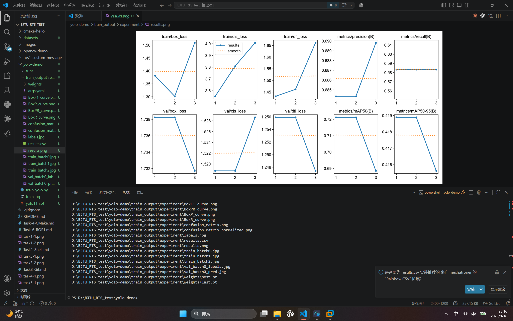
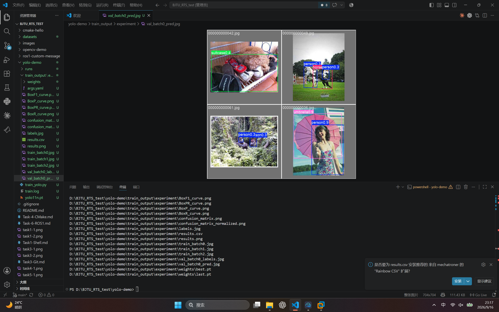

# BJTU-RTS 视觉算法组 Task7：YOLO 目标检测学习报告

## 一、实验环境

- 操作系统：Windows 11
- 开发工具：Visual Studio Code、PowerShell
- Python 版本：3.14.6
- 深度学习框架：PyTorch
- 目标检测框架：Ultralytics YOLO
- 训练设备：CPU

## 二、任务目标

使用 YOLO 完成一次目标检测模型训练，生成训练后的模型权重文件，并查看训练指标与验证集识别结果。

## 三、项目文件说明

```text
yolo-demo/
├── train_yolo.py                         # YOLO 训练脚本
├── train_output/experiment/
│   ├── results.png                        # 训练指标曲线
│   ├── val_batch0_pred.jpg                # 验证集预测结果
│   └── weights/best.pt                    # 训练得到的最佳模型
├── task7-1.png                            # results.png 截图
└── task7-2.png                            # 识别结果截图
```

## 四、环境配置

安装 CPU 版 PyTorch 和 Ultralytics：

```powershell
python -m pip install --index-url https://download.pytorch.org/whl/cpu torch torchvision
python -m pip install -i https://pypi.org/simple ultralytics
```

验证环境：

```powershell
python -c "import torch; from ultralytics import YOLO; print(torch.__version__); print(torch.cuda.is_available())"
```

实验中 `torch.cuda.is_available()` 的结果为 `False`，因此使用 CPU 训练。

## 五、训练程序

`yolo-demo/train_yolo.py` 的核心代码如下：

```python
from pathlib import Path
from ultralytics import YOLO

base_dir = Path(__file__).resolve().parent
model = YOLO(base_dir / "yolo11n.pt")
model.train(
    data="coco8.yaml",
    epochs=3,
    imgsz=320,
    device="cpu",
    workers=0,
    project=base_dir / "train_output",
    name="experiment",
    exist_ok=True,
)
```

其中，`yolo11n.pt` 是小型预训练检测模型；`coco8.yaml` 为 Ultralytics 提供的小型 COCO 数据集配置；训练轮数设置为 3，以便在 CPU 环境中完成一次完整训练流程。

运行训练：

```powershell
cd yolo-demo
$env:KMP_DUPLICATE_LIB_OK="TRUE"
python train_yolo.py
```

`KMP_DUPLICATE_LIB_OK` 仅在当前 PowerShell 窗口临时使用，用于解决 Windows 环境中 OpenMP 运行库重复初始化的问题。

## 六、训练结果

训练完成后，生成的最佳模型权重为：

```text
yolo-demo/train_output/experiment/weights/best.pt
```

同时生成 `results.png`，其中包含损失、精确率、召回率和 mAP 等训练指标曲线。



## 七、识别效果

`val_batch0_pred.jpg` 展示了模型在验证集图像上的预测框和类别标注。虽然本实验使用的是很小的数据集且只训练 3 个 epoch，但已完成从训练到验证预测的完整流程。



## 八、学习总结

本次任务完成了 YOLO 环境安装、模型训练、结果指标查看和验证集目标检测。训练产生的 `best.pt` 可作为后续识别任务的模型输入；`results.png` 用于观察训练过程，验证集预测图用于直观检查识别效果。
